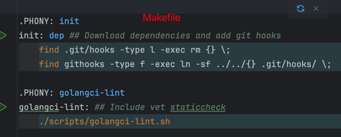

# Makefile

Makefile 可以用来构建所有编程语言的软件包，可以编写适当的命令和规则来适应不同的构建需求  
在具有 Makefile 的当前目录下执行 make 即可
makefile 执行的时候 使用 make 命令，后面接的参数是可执行目标，没有就是第一个，可以有多个，然后使用 空格 隔开，可以执行多个

- 其实可以使用Python来写的
- make help 
  - 如下面的图片所示，我们的 Makefile 里面在命令的后面使用 `##` 进行注释的时候，然后调用 `make help` 就会将对应的命令和 `##` 后面的注释内容显示给我们 
  - 

## 基本语法

1. 规则
2. 变量
3. 伪目标
4. 自动变量
5. 条件语句
6. 包含其他的 Makefile
7. 模式规则

---

1. 真目标规则
    - 这个命令对应要生成相应的目标文件，会执行/被执行的文件
   ```
   target_label: 依赖
        命令
   ```
   如
   ```
   main.o: main.c
        gcc -c main.c   # 这个命令就是将通过该命令将 main.c 编译成 main.o
   ```
2. 变量
   ```
   CC = gcc
   CFLAGS = -Wall -02
   // 使用 $(CC) $(CFLAGS) -c main.c
   ```
3. 伪目标
    - 用来执行一些其他命令
        - 文件清理
        - 运行测试
        - 执行多个目标
   ```
   .PHONY: clean
   clean: 
        rm -f *.o
   ```
4. 自动变量
   ```
   $@: 目标文件
   @<: 第一个依赖文件
   @^: 所有依赖文件
   ...
   ```
5. 条件语句
    - += 使用该符号会自动添加一个空格在最后的结果里面
   ```
   ifeq($(CC),gcc)
        CFLAGS += -gcc-specific-flag
   endif
   ```
6. 包含其他 Makefile
   ```
   include common.mk
   ```

7. 模式规则
    - 可以用来定义从一类文件生成另一类文件，允许使用通配符
   ```
   %.o: %.c
        $(CC) -c $< -o $@
   ```


